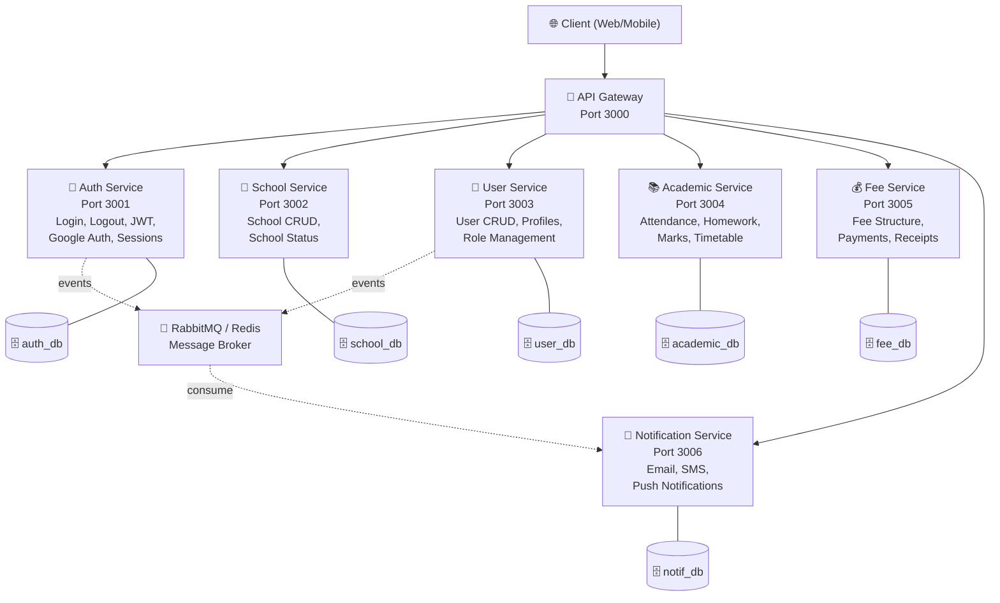
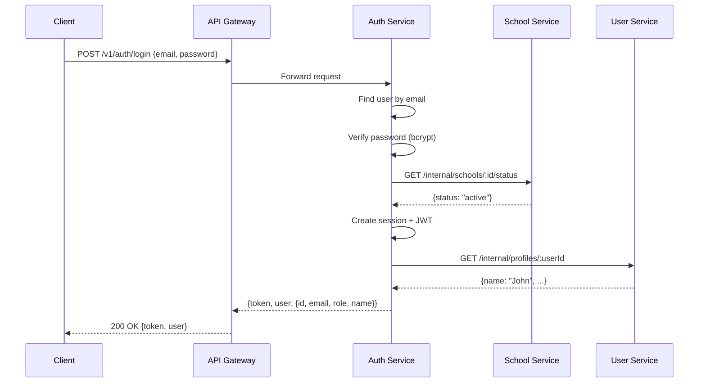
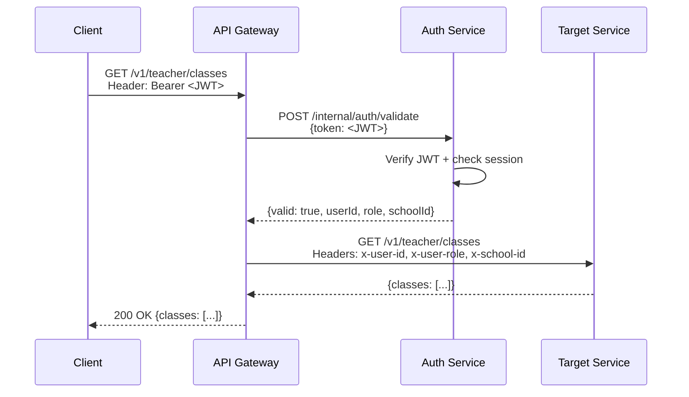

# 🏗️ Monolith → Microservices Migration Plan

> **Project:** School Management Backend  
> **Current State:** Monolith (TypeScript + Express + MongoDB) — Day 2 completed  
> **Target State:** Microservices Architecture — Production-grade learning project

---

## 📖 Table of Contents

1. [Why Microservices?](#1-why-microservices)
2. [Your Current Monolith — What You Have](#2-your-current-monolith--what-you-have)
3. [Microservices Concepts You Need to Know](#3-microservices-concepts-you-need-to-know)
4. [Service Decomposition — How to Split](#4-service-decomposition--how-to-split)
5. [Architecture Overview](#5-architecture-overview)
6. [New Folder Structure — Mono-Repo](#6-new-folder-structure--mono-repo)
7. [Shared Library — `@school/common`](#7-shared-library--schoolcommon)
8. [Database Strategy](#8-database-strategy)
9. [Inter-Service Communication](#9-inter-service-communication)
10. [Authentication Across Services](#10-authentication-across-services)
11. [API Gateway](#11-api-gateway)
12. [Docker & Containerization](#12-docker--containerization)
13. [Production Concerns](#13-production-concerns)
14. [Phased Migration Plan](#14-phased-migration-plan)
15. [Open Questions](#15-open-questions)

---

## 1. Why Microservices?

### Monolith vs Microservices — The Real Difference

```
┌─────────────────────────────────────┐
│           MONOLITH                  │
│  ┌───────────────────────────────┐  │
│  │  Auth + Schools + Teachers +  │  │
│  │  Students + Parents + Fees +  │  │
│  │  Attendance + Notifications   │  │
│  │                               │  │
│  │  ONE codebase                 │  │
│  │  ONE database                 │  │
│  │  ONE deployment               │  │
│  └───────────────────────────────┘  │
└─────────────────────────────────────┘

┌─────────────────────────────────────────────────┐
│              MICROSERVICES                       │
│  ┌──────┐ ┌──────┐ ┌──────┐ ┌──────┐ ┌──────┐  │
│  │ Auth │ │School│ │ User │ │Attend│ │ Fee  │  │
│  │ Svc  │ │ Svc  │ │ Svc  │ │ Svc  │ │ Svc  │  │
│  │      │ │      │ │      │ │      │ │      │  │
│  │ DB-1 │ │ DB-2 │ │ DB-3 │ │ DB-4 │ │ DB-5 │  │
│  └──────┘ └──────┘ └──────┘ └──────┘ └──────┘  │
│                                                  │
│  SEPARATE codebases, databases, deployments      │
└─────────────────────────────────────────────────┘
```

### When Microservices Make Sense

| ✅ Good Reasons | ❌ Bad Reasons |
|---|---|
| Teams need to deploy independently | "Everyone is doing it" |
| Different parts need different scaling | Project is small with 1 developer |
| Clear domain boundaries exist | Trying to fix bad code organization |
| Production needs zero-downtime deploys | Resume-driven development |

### For Your Learning Project

You're building this to learn **production-level** patterns. That's a **great** reason. You'll learn:
- Service isolation and boundaries
- Inter-service communication
- Distributed authentication
- Docker and containerization
- API Gateway patterns
- Message queues for async operations
- Database-per-service pattern

---

## 2. Your Current Monolith — What You Have

Based on your codebase at [src/](file:///d:/SCHOOL/school-management-backend/src):

### Completed (Day 1–2)

| Component | File | Status |
|---|---|---|
| Express Server | [server.ts](file:///d:/SCHOOL/school-management-backend/src/server.ts) | ✅ Working |
| App Startup | [app.ts](file:///d:/SCHOOL/school-management-backend/src/startup/app.ts) | ✅ Working |
| Config | [config/index.ts](file:///d:/SCHOOL/school-management-backend/src/config/index.ts) | ✅ Working |
| Constants & Enums | [constants.ts](file:///d:/SCHOOL/school-management-backend/src/commons/constants.ts) | ✅ All roles, statuses, auth levels |
| User Model | [userModel.ts](file:///d:/SCHOOL/school-management-backend/src/models/userModel.ts) | ✅ Central login identity |
| School Model | [schoolModel.ts](file:///d:/SCHOOL/school-management-backend/src/models/schoolModel.ts) | ✅ Tenant model |
| Session Model | [sessionModel.ts](file:///d:/SCHOOL/school-management-backend/src/models/sessionModel.ts) | ✅ With role & schoolId |
| Login Audit Model | [loginAuditModel.ts](file:///d:/SCHOOL/school-management-backend/src/models/loginAuditModel.ts) | ✅ Security trail |
| Admin Controller | [adminController.ts](file:///d:/SCHOOL/school-management-backend/src/controllers/adminController.ts) | ✅ Login/logout/profile/password |
| Auth Service | [authService.ts](file:///d:/SCHOOL/school-management-backend/src/services/authService.ts) | ✅ JWT + session validation |
| Route Utils | [routeUtils.ts](file:///d:/SCHOOL/school-management-backend/src/utils/routeUtils.ts) | ✅ Route registration + Joi |
| DB Migration | [dbMigration.ts](file:///d:/SCHOOL/school-management-backend/src/utils/dbMigration.ts) | ✅ Super Admin seed |
| Middleware | [errorHandler.ts](file:///d:/SCHOOL/school-management-backend/src/middleware/errorHandler.ts), [requestLogger.ts](file:///d:/SCHOOL/school-management-backend/src/middleware/requestLogger.ts) | ✅ Working |
| Interfaces | [interfaces/index.ts](file:///d:/SCHOOL/school-management-backend/src/interfaces/index.ts) | ✅ AuthContext, ApiResponse, Pagination |

### Not Yet Built (Day 3–7 from task.md)

- Auth Controller (new multi-role login)
- Google Auth Service
- Super Admin APIs (create school admins, read-only school visibility)
- School Admin APIs (user creation)
- Teacher/Parent/Student/Guest Controllers
- Permission Service
- Role-specific profile models
- Password reset flow
- Tests

> [!IMPORTANT]
> **Key Insight:** Since you've only completed Day 2 (models and constants), this is actually the **perfect** time to migrate. You haven't built the complex business logic yet. Moving now means you don't have to refactor later.

---

## 3. Microservices Concepts You Need to Know

### 3.1 Service Boundary (Domain-Driven Design)

Each service owns **one business domain**. It has its own:
- Codebase (separate folder or repo)
- Database (or at least separate collections)
- API endpoints
- Deployment

```
Think of it like departments in a real school:
  - Front Office (Auth) → handles who can enter
  - Admin Office (School) → manages school setup
  - Staff Room (User) → manages all people
  - Classrooms (Academic) → attendance, homework, marks
  - Accounts (Fee) → manages money
  - Notice Board (Notification) → announcements
```

### 3.2 API Gateway

The **single entry point** for all client requests. It:
- Routes requests to the correct service
- Handles authentication (validates JWT)
- Rate limiting
- Request logging
- CORS

```
Client → API Gateway → Auth Service
                     → School Service
                     → User Service
                     → Academic Service
```

### 3.3 Inter-Service Communication

Two patterns:

| Pattern | When to Use | Example |
|---|---|---|
| **Synchronous (HTTP/REST)** | Need immediate response | Auth service validates token for User service |
| **Asynchronous (Message Queue)** | Fire-and-forget, events | "Student created" → Notification service sends welcome email |

### 3.4 Database Per Service

Each service has its **own database** (or separate collections in MongoDB). Services **never** directly access another service's database.

```
❌ WRONG: User Service queries the schools collection directly
✅ RIGHT: User Service calls School Service API to get school data
```

### 3.5 Shared Library

Code that's common across services (types, constants, utilities) lives in a **shared package** that all services import.

### 3.6 Service Discovery

In development: services know each other's URLs via environment variables.  
In production: use Docker Compose service names (or Kubernetes DNS).

### 3.7 Health Checks

Every service exposes a `/health` endpoint. The gateway and Docker use this to know if a service is alive.

---

## 4. Service Decomposition — How to Split

### Identifying Services from Your Domain

Based on your [LOGIN_ARCHITECTURE.md](file:///d:/SCHOOL/school-management-backend/LOGIN_ARCHITECTURE.md), here's how I'd split:



### Service Responsibilities

#### 🔐 Auth Service (Port 3001)
**Owns:** Authentication, sessions, tokens  
**Collections:** `users` (login credentials only), `sessions`, `loginAudits`  

| Endpoint | Method | Description |
|---|---|---|
| `/v1/auth/login` | POST | Email/password login |
| `/v1/auth/google` | POST | Google OAuth login |
| `/v1/auth/logout` | POST | Revoke session |
| `/v1/auth/me` | GET | Current user from session |
| `/v1/auth/refresh` | POST | Refresh token |
| `/v1/auth/forgot-password` | POST | Send reset email |
| `/v1/auth/reset-password` | POST | Reset password |
| `/v1/auth/validate` | POST | **Internal only** — validate JWT for other services |

> [!NOTE]
> The Auth Service stores minimal user data: `email`, `passwordHash`, `role`, `schoolId`, `status`. It does NOT store profile details like name, phone, etc. Those belong to the User Service.

---

#### 🏫 School Service (Port 3002)
**Owns:** School tenant data, school configuration  
**Collections:** `schools`

| Endpoint | Method | Description |
|---|---|---|
| `/v1/auth/school-admins` | POST | Create school admin (Super Admin) |
| `/v1/schools` | POST | Create school (School Admin) |
| `/v1/schools` | GET | List schools (Super Admin read-only all; School Admin own schools) |
| `/v1/schools/:id` | GET | Get school details (Super Admin read-only; School Admin own schools) |
| `/v1/schools/:id` | PUT | Update school (School Admin own schools) |
| `/v1/schools/:id/status` | PUT | Suspend/activate (School Admin own schools) |
| `/v1/schools/code/:code` | GET | Get school by code |
| `/v1/internal/schools/:id/status` | GET | **Internal only** — check if school is active |

---

#### 👤 User Service (Port 3003)
**Owns:** User profiles, role-specific data, parent-student linking  
**Collections:** `superAdmins`, `schoolAdmins`, `teachers`, `parents`, `students`, `guests`, `schoolMemberships`

| Endpoint | Method | Description |
|---|---|---|
| `/v1/users/profiles/:userId` | GET | Get user profile |
| `/v1/school-admin/operators` | POST | Create operator |
| `/v1/school-admin/teachers` | POST | Create teacher |
| `/v1/school-admin/students` | POST | Create student |
| `/v1/school-admin/parents` | POST | Create parent |
| `/v1/school-admin/parents/link-student` | POST | Link parent ↔ student |
| `/v1/teacher/classes` | GET | Teacher's assigned classes |
| `/v1/parent/students` | GET | Parent's linked students |
| `/v1/student/profile` | GET | Student's own profile |

> [!NOTE]
> When creating a new user (e.g., a teacher), the User Service calls the Auth Service internally to create the login credentials, then stores the profile data locally.

---

#### 📚 Academic Service (Port 3004)
**Owns:** Attendance, homework, marks, timetable, classes, sections, subjects  
**Collections:** `classes`, `sections`, `subjects`, `attendance`, `homework`, `marks`, `timetables`

| Endpoint | Method | Description |
|---|---|---|
| `/v1/teacher/attendance` | POST | Mark attendance |
| `/v1/teacher/homework` | POST | Add homework |
| `/v1/teacher/marks` | POST | Add marks |
| `/v1/student/timetable` | GET | View timetable |
| `/v1/student/homework` | GET | View homework |
| `/v1/student/attendance` | GET | View attendance |
| `/v1/student/report-card` | GET | View report card |
| `/v1/parent/students/:id/attendance` | GET | Child's attendance |
| `/v1/parent/students/:id/report-card` | GET | Child's report card |

---

#### 💰 Fee Service (Port 3005)
**Owns:** Fee structure, payments, receipts, dues  
**Collections:** `feeStructures`, `feePayments`, `feeReceipts`

| Endpoint | Method | Description |
|---|---|---|
| `/v1/fees/structure` | POST/GET | Fee structure CRUD |
| `/v1/fees/payments` | POST | Record payment |
| `/v1/fees/students/:id` | GET | Student's fee status |
| `/v1/parent/students/:id/fees` | GET | Parent view of fees |

---

#### 📢 Notification Service (Port 3006)
**Owns:** Emails, SMS, push notifications, notices  
**Collections:** `notifications`, `emailTemplates`, `notices`

This service **only listens to events** from other services. It doesn't receive direct API calls from clients (except for viewing notices).

| Trigger Event | Action |
|---|---|
| `user.created` | Send welcome email |
| `password.reset.requested` | Send reset email |
| `fee.payment.received` | Send receipt email |
| `attendance.marked` | Notify parents |
| `homework.assigned` | Notify students & parents |

---

## 5. Architecture Overview

### Request Flow — How a Login Works in Microservices



### Request Flow — How a Protected Request Works



> [!TIP]
> The **API Gateway** handles JWT validation for ALL services. Individual services trust the headers (`x-user-id`, `x-user-role`, `x-school-id`) set by the gateway. This means services don't need to implement their own auth middleware — they just read headers.

---

## 6. New Folder Structure — Mono-Repo

> [!IMPORTANT]
> I recommend a **mono-repo** approach (all services in one Git repository) for your learning project. This is easier to manage, share code, and develop locally compared to separate repositories.

```
d:\SCHOOL\school-management-backend\
├── packages/
│   └── common/                          ← Shared library (@school/common)
│       ├── src/
│       │   ├── constants/
│       │   │   ├── index.ts
│       │   │   ├── roles.ts             ← USER_ROLES, AVAILABLE_AUTHS
│       │   │   ├── status.ts            ← USER_STATUS, SCHOOL_STATUS
│       │   │   └── messages.ts          ← All message strings
│       │   ├── interfaces/
│       │   │   ├── index.ts
│       │   │   ├── auth.ts              ← AuthContext, JwtPayload
│       │   │   ├── api.ts               ← ApiResponse, PaginatedResponse
│       │   │   └── models.ts            ← IUser, ISchool, ISession
│       │   ├── utils/
│       │   │   ├── response.ts          ← sendSuccess(), sendError() helpers
│       │   │   ├── logger.ts            ← Winston logger factory
│       │   │   └── validation.ts        ← Common Joi schemas (email, password)
│       │   ├── middleware/
│       │   │   ├── errorHandler.ts
│       │   │   ├── requestLogger.ts
│       │   │   └── internalAuth.ts      ← Validate internal service calls
│       │   └── index.ts                 ← Re-exports everything
│       ├── package.json
│       └── tsconfig.json
│
├── services/
│   ├── api-gateway/                     ← API Gateway (Port 3000)
│   │   ├── src/
│   │   │   ├── server.ts
│   │   │   ├── config/
│   │   │   │   └── index.ts
│   │   │   ├── routes/
│   │   │   │   ├── authProxy.ts         ← /v1/auth/* → Auth Service
│   │   │   │   ├── schoolProxy.ts       ← /v1/schools/* → School Service
│   │   │   │   ├── userProxy.ts         ← /v1/school-admin/*, /v1/teacher/*, etc.
│   │   │   │   ├── academicProxy.ts     ← Attendance, homework, marks
│   │   │   │   └── feeProxy.ts          ← Fee endpoints
│   │   │   ├── middleware/
│   │   │   │   ├── authMiddleware.ts     ← JWT validation + header injection
│   │   │   │   ├── rateLimiter.ts
│   │   │   │   └── roleGuard.ts         ← Route-level role checking
│   │   │   └── startup/
│   │   │       └── app.ts
│   │   ├── package.json
│   │   ├── tsconfig.json
│   │   ├── Dockerfile
│   │   └── .env.example
│   │
│   ├── auth-service/                    ← Auth Service (Port 3001)
│   │   ├── src/
│   │   │   ├── server.ts
│   │   │   ├── config/
│   │   │   │   └── index.ts
│   │   │   ├── controllers/
│   │   │   │   └── authController.ts
│   │   │   ├── models/
│   │   │   │   ├── userModel.ts         ← Login credentials only
│   │   │   │   ├── sessionModel.ts
│   │   │   │   └── loginAuditModel.ts
│   │   │   ├── services/
│   │   │   │   ├── authService.ts       ← JWT, bcrypt, session logic
│   │   │   │   ├── googleAuthService.ts ← Google ID token verification
│   │   │   │   └── databaseService.ts
│   │   │   ├── routes/
│   │   │   │   └── authRoutes.ts
│   │   │   ├── utils/
│   │   │   │   ├── routeUtils.ts
│   │   │   │   └── dbMigration.ts       ← Seed Super Admin
│   │   │   └── startup/
│   │   │       └── app.ts
│   │   ├── package.json
│   │   ├── tsconfig.json
│   │   ├── Dockerfile
│   │   └── .env.example
│   │
│   ├── school-service/                  ← School Service (Port 3002)
│   │   ├── src/
│   │   │   ├── server.ts
│   │   │   ├── config/
│   │   │   ├── controllers/
│   │   │   │   └── schoolController.ts
│   │   │   ├── models/
│   │   │   │   └── schoolModel.ts
│   │   │   ├── services/
│   │   │   ├── routes/
│   │   │   │   └── schoolRoutes.ts
│   │   │   └── startup/
│   │   │       └── app.ts
│   │   ├── package.json
│   │   ├── tsconfig.json
│   │   ├── Dockerfile
│   │   └── .env.example
│   │
│   ├── user-service/                    ← User Service (Port 3003)
│   │   ├── src/
│   │   │   ├── server.ts
│   │   │   ├── config/
│   │   │   ├── controllers/
│   │   │   │   ├── profileController.ts
│   │   │   │   ├── schoolAdminController.ts
│   │   │   │   └── parentController.ts
│   │   │   ├── models/
│   │   │   │   ├── superAdminModel.ts
│   │   │   │   ├── schoolAdminModel.ts
│   │   │   │   ├── teacherModel.ts
│   │   │   │   ├── parentModel.ts
│   │   │   │   ├── studentModel.ts
│   │   │   │   ├── guestModel.ts
│   │   │   │   └── schoolMembershipModel.ts
│   │   │   ├── services/
│   │   │   │   └── authClient.ts        ← HTTP client to call Auth Service
│   │   │   ├── routes/
│   │   │   └── startup/
│   │   ├── package.json
│   │   ├── tsconfig.json
│   │   ├── Dockerfile
│   │   └── .env.example
│   │
│   ├── academic-service/                ← Academic Service (Port 3004)
│   │   ├── src/
│   │   │   ├── server.ts
│   │   │   ├── controllers/
│   │   │   │   ├── attendanceController.ts
│   │   │   │   ├── homeworkController.ts
│   │   │   │   ├── marksController.ts
│   │   │   │   └── timetableController.ts
│   │   │   ├── models/
│   │   │   │   ├── classModel.ts
│   │   │   │   ├── sectionModel.ts
│   │   │   │   ├── subjectModel.ts
│   │   │   │   ├── attendanceModel.ts
│   │   │   │   ├── homeworkModel.ts
│   │   │   │   ├── marksModel.ts
│   │   │   │   └── timetableModel.ts
│   │   │   ├── services/
│   │   │   ├── routes/
│   │   │   └── startup/
│   │   ├── package.json
│   │   ├── tsconfig.json
│   │   └── Dockerfile
│   │
│   ├── fee-service/                     ← Fee Service (Port 3005)
│   │   ├── src/
│   │   │   ├── server.ts
│   │   │   ├── controllers/
│   │   │   ├── models/
│   │   │   ├── services/
│   │   │   ├── routes/
│   │   │   └── startup/
│   │   ├── package.json
│   │   ├── tsconfig.json
│   │   └── Dockerfile
│   │
│   └── notification-service/            ← Notification Service (Port 3006)
│       ├── src/
│       │   ├── server.ts
│       │   ├── consumers/               ← Message queue consumers
│       │   │   ├── userEventConsumer.ts
│       │   │   ├── feeEventConsumer.ts
│       │   │   └── academicEventConsumer.ts
│       │   ├── services/
│       │   │   ├── emailService.ts
│       │   │   └── templateService.ts
│       │   ├── templates/
│       │   │   ├── welcome.hbs
│       │   │   ├── passwordReset.hbs
│       │   │   └── feeReceipt.hbs
│       │   └── startup/
│       ├── package.json
│       ├── tsconfig.json
│       └── Dockerfile
│
├── docker-compose.yml                   ← Run everything locally
├── docker-compose.dev.yml               ← Dev overrides (hot reload)
├── package.json                         ← Root workspace config
├── tsconfig.base.json                   ← Shared TypeScript config
├── .env.example                         ← Root env template
└── README.md
```

---

## 7. Shared Library — `@school/common`

This is the most important pattern. Instead of duplicating constants, types, and utilities across 6 services, you create one shared package.

### What Goes in the Shared Library

```ts
// packages/common/src/constants/roles.ts
export const USER_ROLES = {
  SUPER_ADMIN: 'super_admin',
  SCHOOL_ADMIN: 'school_admin',
  SCHOOL_OPERATOR: 'school_operator',
  TEACHER: 'teacher',
  PARENT: 'parent',
  STUDENT: 'student',
  GUEST: 'guest',
} as const;

export const AVAILABLE_AUTHS = {
  SUPER_ADMIN: 1,
  SCHOOL_ADMIN: 2,
  SCHOOL_OPERATOR: 3,
  TEACHER: 4,
  PARENT: 5,
  STUDENT: 6,
  GUEST: 7,
  ANY_LOGGED_IN_USER: 8,
} as const;
```

```ts
// packages/common/src/utils/response.ts
import { Response } from 'express';

export function sendSuccess(res: Response, data: any, message: string, statusCode = 200) {
  return res.status(statusCode).json({
    statusCode,
    status: true,
    message,
    type: 'SUCCESS',
    data,
  });
}

export function sendError(res: Response, message: string, statusCode = 500, type = 'ERROR') {
  return res.status(statusCode).json({
    statusCode,
    status: false,
    message,
    type,
  });
}
```

### How Services Use It

```ts
// In any service's controller:
import { USER_ROLES, MESSAGES, sendSuccess, sendError } from '@school/common';
```

### How It's Linked (npm workspaces)

```json
// Root package.json
{
  "name": "school-management",
  "private": true,
  "workspaces": [
    "packages/*",
    "services/*"
  ]
}
```

```json
// services/auth-service/package.json
{
  "name": "@school/auth-service",
  "dependencies": {
    "@school/common": "workspace:*"
  }
}
```

> [!TIP]
> **npm workspaces** let you link packages locally without publishing to npm. When you `import from '@school/common'`, it automatically resolves to `packages/common/`. No npm publish needed!

---

## 8. Database Strategy

### Option A: Separate Databases (Recommended for learning)

Each service gets its own MongoDB database:

```
MongoDB Instance
├── school_auth_db        ← Auth Service
│   ├── users             (login credentials)
│   ├── sessions
│   └── loginAudits
│
├── school_school_db      ← School Service
│   └── schools
│
├── school_user_db        ← User Service
│   ├── superAdmins
│   ├── schoolAdmins
│   ├── teachers
│   ├── parents
│   ├── students
│   ├── guests
│   └── schoolMemberships
│
├── school_academic_db    ← Academic Service
│   ├── classes
│   ├── sections
│   ├── subjects
│   ├── attendance
│   ├── homework
│   ├── marks
│   └── timetables
│
├── school_fee_db         ← Fee Service
│   ├── feeStructures
│   ├── feePayments
│   └── feeReceipts
│
└── school_notif_db       ← Notification Service
    ├── notifications
    ├── emailTemplates
    └── notices
```

### Option B: Same Database, Separate Collections

Simpler for development — one MongoDB instance, one database, but each service only touches its own collections. This is fine for a learning project.

### Each Service's Config

```ts
// services/auth-service/src/config/index.ts
const config = {
  PORT: process.env.PORT || 3001,
  MONGODB_URI: process.env.MONGODB_URI || 'mongodb://localhost:27017/school_auth_db',
  JWT_SECRET: process.env.JWT_SECRET || 'default-jwt-secret',
  // ... auth-specific config
};
```

---

## 9. Inter-Service Communication

### 9.1 Synchronous — HTTP Client

When Service A needs data from Service B **right now**:

```ts
// services/user-service/src/services/authClient.ts
import axios from 'axios';
import config from '../config';

class AuthClient {
  private baseUrl: string;

  constructor() {
    this.baseUrl = config.AUTH_SERVICE_URL; // http://auth-service:3001
  }

  async createUser(userData: {
    email: string;
    password: string;
    role: string;
    schoolId?: string;
  }) {
    const response = await axios.post(
      `${this.baseUrl}/internal/users`,
      userData,
      {
        headers: {
          'x-internal-key': config.INTERNAL_API_KEY, // Shared secret
        },
      }
    );
    return response.data;
  }

  async validateToken(token: string) {
    const response = await axios.post(
      `${this.baseUrl}/internal/auth/validate`,
      { token },
      {
        headers: {
          'x-internal-key': config.INTERNAL_API_KEY,
        },
      }
    );
    return response.data;
  }
}

export default new AuthClient();
```

### 9.2 Asynchronous — Event Bus (Redis Pub/Sub or RabbitMQ)

When Service A wants to **notify** other services without waiting:

```ts
// services/auth-service/src/services/eventPublisher.ts
import Redis from 'ioredis';

const redis = new Redis(process.env.REDIS_URL);

export async function publishEvent(event: string, data: any) {
  await redis.publish('school-events', JSON.stringify({
    event,
    data,
    timestamp: new Date().toISOString(),
    source: 'auth-service',
  }));
}

// Usage in authController.ts:
// After successful login:
await publishEvent('user.logged_in', { userId, role, schoolId });

// After user creation:
await publishEvent('user.created', { userId, email, role, schoolId });
```

```ts
// services/notification-service/src/consumers/userEventConsumer.ts
import Redis from 'ioredis';

const subscriber = new Redis(process.env.REDIS_URL);

subscriber.subscribe('school-events');

subscriber.on('message', async (_channel, message) => {
  const { event, data } = JSON.parse(message);

  switch (event) {
    case 'user.created':
      await sendWelcomeEmail(data.email, data.role);
      break;
    case 'password.reset.requested':
      await sendPasswordResetEmail(data.email, data.resetToken);
      break;
  }
});
```

> [!TIP]
> **Start with Redis Pub/Sub** for simplicity. Move to RabbitMQ later if you need guaranteed delivery, dead-letter queues, or complex routing. For your learning project, Redis is perfect because you'll likely use it for caching too.

---

## 10. Authentication Across Services

This is the trickiest part of microservices. Here's the pattern:

### The Flow

```
1. Client logs in → Auth Service creates JWT
2. Client sends JWT in every request → API Gateway
3. API Gateway validates JWT by calling Auth Service
4. API Gateway injects user info as HTTP headers
5. Target service reads headers — no JWT logic needed!
```

### API Gateway Auth Middleware

```ts
// services/api-gateway/src/middleware/authMiddleware.ts
import axios from 'axios';

const AUTH_SERVICE_URL = process.env.AUTH_SERVICE_URL;

export async function authMiddleware(req, res, next) {
  const authHeader = req.headers.authorization;
  
  if (!authHeader) {
    return res.status(401).json({ message: 'No token provided' });
  }

  try {
    // Ask Auth Service to validate the token
    const { data } = await axios.post(`${AUTH_SERVICE_URL}/internal/auth/validate`, {
      token: authHeader.replace('Bearer ', ''),
    }, {
      headers: { 'x-internal-key': process.env.INTERNAL_API_KEY },
    });

    if (!data.valid) {
      return res.status(401).json({ message: 'Invalid token' });
    }

    // Inject user info as headers for downstream services
    req.headers['x-user-id'] = data.userId;
    req.headers['x-user-role'] = data.role;
    req.headers['x-school-id'] = data.schoolId || '';
    req.headers['x-session-id'] = data.sessionId;
    
    next();
  } catch (error) {
    return res.status(401).json({ message: 'Authentication failed' });
  }
}
```

### How Services Read Auth Info

```ts
// In any service's controller (e.g., academic-service):
async function markAttendance(req, res) {
  const userId = req.headers['x-user-id'];
  const role = req.headers['x-user-role'];
  const schoolId = req.headers['x-school-id'];

  // No JWT validation needed! Gateway already did it.
  
  if (role !== 'teacher' && role !== 'school_admin') {
    return res.status(403).json({ message: 'Forbidden' });
  }

  // Business logic...
}
```

### Internal API Security

Services must **never** be accessible directly from the internet. Only the API Gateway is public.

```
Internet → [API Gateway:3000] → [Internal Network]
                                  ├── Auth Service:3001
                                  ├── School Service:3002
                                  ├── User Service:3003
                                  └── ...
```

For internal service-to-service calls, use a shared API key:

```ts
// Middleware for internal endpoints
export function internalAuth(req, res, next) {
  const key = req.headers['x-internal-key'];
  if (key !== process.env.INTERNAL_API_KEY) {
    return res.status(403).json({ message: 'Internal access only' });
  }
  next();
}
```

---

## 11. API Gateway

The gateway is a lightweight Express app that proxies requests:

```ts
// services/api-gateway/src/routes/authProxy.ts
import { Router } from 'express';
import { createProxyMiddleware } from 'http-proxy-middleware';

const router = Router();

const AUTH_SERVICE_URL = process.env.AUTH_SERVICE_URL || 'http://localhost:3001';

// Auth routes — NO auth middleware (login is public)
router.use('/v1/auth', createProxyMiddleware({
  target: AUTH_SERVICE_URL,
  changeOrigin: true,
  pathRewrite: { '^/v1/auth': '/v1/auth' },
}));

export default router;
```

```ts
// services/api-gateway/src/routes/academicProxy.ts
import { Router } from 'express';
import { createProxyMiddleware } from 'http-proxy-middleware';
import { authMiddleware } from '../middleware/authMiddleware';

const router = Router();

const ACADEMIC_SERVICE_URL = process.env.ACADEMIC_SERVICE_URL || 'http://localhost:3004';

// Academic routes — REQUIRES auth
router.use('/v1/teacher', authMiddleware, createProxyMiddleware({
  target: ACADEMIC_SERVICE_URL,
  changeOrigin: true,
}));

router.use('/v1/student', authMiddleware, createProxyMiddleware({
  target: ACADEMIC_SERVICE_URL,
  changeOrigin: true,
}));

export default router;
```

> [!TIP]
> Instead of `http-proxy-middleware`, you can also write simple `axios`-based proxying for more control. The proxy library is simpler to start with, but manual proxying gives you the ability to transform requests/responses.

---

## 12. Docker & Containerization

### Dockerfile (Same for all services)

```dockerfile
# services/auth-service/Dockerfile
FROM node:20-alpine AS builder
WORKDIR /app

# Copy root workspace files
COPY package.json package-lock.json ./
COPY packages/common/package.json ./packages/common/
COPY services/auth-service/package.json ./services/auth-service/

# Install dependencies
RUN npm ci --workspace=@school/auth-service

# Copy source
COPY packages/common/ ./packages/common/
COPY services/auth-service/ ./services/auth-service/
COPY tsconfig.base.json ./

# Build
RUN npm run build --workspace=@school/common
RUN npm run build --workspace=@school/auth-service

# Production stage
FROM node:20-alpine
WORKDIR /app
COPY --from=builder /app/services/auth-service/dist ./dist
COPY --from=builder /app/node_modules ./node_modules
COPY --from=builder /app/packages/common/dist ./packages/common/dist

EXPOSE 3001
CMD ["node", "dist/server.js"]
```

### docker-compose.yml

```yaml
version: '3.8'

services:
  # --- Infrastructure ---
  mongodb:
    image: mongo:7
    container_name: school-mongo
    ports:
      - "27017:27017"
    volumes:
      - mongo_data:/data/db
    networks:
      - school-network

  redis:
    image: redis:7-alpine
    container_name: school-redis
    ports:
      - "6379:6379"
    networks:
      - school-network

  # --- API Gateway ---
  api-gateway:
    build:
      context: .
      dockerfile: services/api-gateway/Dockerfile
    container_name: school-gateway
    ports:
      - "3000:3000"
    environment:
      - PORT=3000
      - AUTH_SERVICE_URL=http://auth-service:3001
      - SCHOOL_SERVICE_URL=http://school-service:3002
      - USER_SERVICE_URL=http://user-service:3003
      - ACADEMIC_SERVICE_URL=http://academic-service:3004
      - FEE_SERVICE_URL=http://fee-service:3005
      - INTERNAL_API_KEY=${INTERNAL_API_KEY}
    depends_on:
      - auth-service
      - school-service
      - user-service
    networks:
      - school-network

  # --- Services ---
  auth-service:
    build:
      context: .
      dockerfile: services/auth-service/Dockerfile
    container_name: school-auth
    ports:
      - "3001:3001"
    environment:
      - PORT=3001
      - MONGODB_URI=mongodb://mongodb:27017/school_auth_db
      - JWT_SECRET=${JWT_SECRET}
      - REDIS_URL=redis://redis:6379
      - INTERNAL_API_KEY=${INTERNAL_API_KEY}
      - GOOGLE_CLIENT_ID=${GOOGLE_CLIENT_ID}
    depends_on:
      - mongodb
      - redis
    networks:
      - school-network

  school-service:
    build:
      context: .
      dockerfile: services/school-service/Dockerfile
    container_name: school-school
    ports:
      - "3002:3002"
    environment:
      - PORT=3002
      - MONGODB_URI=mongodb://mongodb:27017/school_school_db
      - INTERNAL_API_KEY=${INTERNAL_API_KEY}
    depends_on:
      - mongodb
    networks:
      - school-network

  user-service:
    build:
      context: .
      dockerfile: services/user-service/Dockerfile
    container_name: school-user
    ports:
      - "3003:3003"
    environment:
      - PORT=3003
      - MONGODB_URI=mongodb://mongodb:27017/school_user_db
      - AUTH_SERVICE_URL=http://auth-service:3001
      - REDIS_URL=redis://redis:6379
      - INTERNAL_API_KEY=${INTERNAL_API_KEY}
    depends_on:
      - mongodb
      - auth-service
    networks:
      - school-network

  academic-service:
    build:
      context: .
      dockerfile: services/academic-service/Dockerfile
    container_name: school-academic
    ports:
      - "3004:3004"
    environment:
      - PORT=3004
      - MONGODB_URI=mongodb://mongodb:27017/school_academic_db
      - USER_SERVICE_URL=http://user-service:3003
      - INTERNAL_API_KEY=${INTERNAL_API_KEY}
    depends_on:
      - mongodb
    networks:
      - school-network

  fee-service:
    build:
      context: .
      dockerfile: services/fee-service/Dockerfile
    container_name: school-fee
    ports:
      - "3005:3005"
    environment:
      - PORT=3005
      - MONGODB_URI=mongodb://mongodb:27017/school_fee_db
      - REDIS_URL=redis://redis:6379
      - INTERNAL_API_KEY=${INTERNAL_API_KEY}
    depends_on:
      - mongodb
    networks:
      - school-network

  notification-service:
    build:
      context: .
      dockerfile: services/notification-service/Dockerfile
    container_name: school-notif
    ports:
      - "3006:3006"
    environment:
      - PORT=3006
      - MONGODB_URI=mongodb://mongodb:27017/school_notif_db
      - REDIS_URL=redis://redis:6379
      - SMTP_HOST=${SMTP_HOST}
      - SMTP_PORT=${SMTP_PORT}
      - SMTP_USER=${SMTP_USER}
      - SMTP_PASS=${SMTP_PASS}
    depends_on:
      - mongodb
      - redis
    networks:
      - school-network

volumes:
  mongo_data:

networks:
  school-network:
    driver: bridge
```

### Running Everything

```bash
# Start all services
docker-compose up -d

# View logs for a specific service
docker-compose logs -f auth-service

# Rebuild after code changes
docker-compose up -d --build auth-service

# Stop everything
docker-compose down
```

### Development Mode (Hot Reload)

For development, you DON'T need Docker. Run each service separately:

```bash
# Terminal 1 — Auth Service
cd services/auth-service && npm run dev

# Terminal 2 — School Service
cd services/school-service && npm run dev

# Terminal 3 — API Gateway
cd services/api-gateway && npm run dev

# ... etc
```

Or use `docker-compose.dev.yml` with volume mounts for hot reload.

---

## 13. Production Concerns

### 13.1 Logging

Each service logs with its service name. Use a centralized log collector:

```ts
// packages/common/src/utils/logger.ts
export function createLogger(serviceName: string) {
  return winston.createLogger({
    defaultMeta: { service: serviceName },
    // ... same config as your current logger
  });
}

// Usage in auth-service:
import { createLogger } from '@school/common';
const logger = createLogger('auth-service');
```

### 13.2 Health Checks

```ts
// Every service should have this:
app.get('/health', (req, res) => {
  res.status(200).json({
    status: 'healthy',
    service: 'auth-service',
    timestamp: new Date().toISOString(),
    uptime: process.uptime(),
  });
});
```

### 13.3 Error Handling

Consistent error responses across all services using the shared library.

### 13.4 Rate Limiting

Applied at the **API Gateway** level only. Individual services don't need their own rate limiters.

### 13.5 CORS

Configured at the **API Gateway** level only. Individual services accept all origins (they're internal).

### 13.6 Swagger

Each service generates its own Swagger doc. The API Gateway aggregates them or hosts a unified Swagger UI.

---

## 14. Phased Migration Plan

> [!IMPORTANT]
> Do NOT try to build all 6 services at once. Build them incrementally.

### Phase 1 — Foundation (Week 1)

**Goal:** Set up mono-repo, shared library, API Gateway, and Auth Service

```
Day 1-2: Mono-repo setup
  - [ ] Create root package.json with workspaces
  - [ ] Create tsconfig.base.json
  - [ ] Create packages/common/ with constants, interfaces, utilities
  - [ ] Move USER_ROLES, STATUS_CODES, MESSAGES, logger, etc. to common
  - [ ] Verify common package builds and can be imported

Day 3-4: Auth Service
  - [ ] Create services/auth-service/ structure
  - [ ] Move userModel, sessionModel, loginAuditModel to auth-service
  - [ ] Move authService, adminController login/logout/profile logic
  - [ ] Create authController with multi-role login
  - [ ] Add Google Auth support
  - [ ] Add internal /validate endpoint
  - [ ] Add dbMigration for Super Admin seed
  - [ ] Test auth service independently (Postman)

Day 5: API Gateway
  - [ ] Create services/api-gateway/ structure  
  - [ ] Add auth middleware (calls Auth Service for validation)
  - [ ] Add proxy routes for /v1/auth/* (public)
  - [ ] Add rate limiting at gateway level
  - [ ] Add CORS at gateway level
  - [ ] Add health check aggregation
  - [ ] Test: Client → Gateway → Auth Service flow
```

### Phase 2 — Core Services (Week 2)

**Goal:** School Service + User Service

```
Day 1-2: School Service
  - [ ] Create services/school-service/ structure
  - [ ] Move schoolModel to school-service
  - [ ] Create schoolController (CRUD + status)
  - [ ] Add internal endpoint for school status check
  - [ ] Add school routes
  - [ ] Update gateway proxy routes
  - [ ] Test: Create school, list schools, suspend school

Day 3-5: User Service
  - [ ] Create services/user-service/ structure
  - [ ] Create all profile models (superAdmin, schoolAdmin, teacher, parent, student, guest)
  - [ ] Create schoolAdminController (create operators, teachers, students, parents)
  - [ ] Create parent-student linking logic
  - [ ] Add authClient to call Auth Service for user creation
  - [ ] Add internal profile lookup endpoint
  - [ ] Update gateway proxy routes
  - [ ] Test: Full user creation flow (School Admin creates teacher, etc.)
```

### Phase 3 — Domain Services (Week 3)

**Goal:** Academic Service + Fee Service

```
Day 1-3: Academic Service
  - [ ] Create services/academic-service/ structure
  - [ ] Create class, section, subject, attendance, homework, marks, timetable models
  - [ ] Create controllers for teacher, student, parent views
  - [ ] Update gateway proxy routes
  - [ ] Test: Mark attendance, add homework, view report card

Day 4-5: Fee Service
  - [ ] Create services/fee-service/ structure
  - [ ] Create fee structure, payment, receipt models
  - [ ] Create fee controllers
  - [ ] Update gateway proxy routes
  - [ ] Test: Create fee structure, record payment, view student fees
```

### Phase 4 — Async & Polish (Week 4)

**Goal:** Notification Service, Docker, Testing, Documentation

```
Day 1-2: Notification Service + Event Bus
  - [ ] Set up Redis Pub/Sub
  - [ ] Create notification-service with event consumers
  - [ ] Add event publishing in auth, user, fee services
  - [ ] Create email templates
  - [ ] Test: User created → welcome email sent

Day 3-4: Docker
  - [ ] Create Dockerfiles for each service
  - [ ] Create docker-compose.yml
  - [ ] Test full stack with Docker
  - [ ] Create docker-compose.dev.yml for development

Day 5: Polish
  - [ ] Security hardening (rate limits, input validation, etc.)
  - [ ] Swagger documentation for all services
  - [ ] Update README with microservices setup guide
  - [ ] End-to-end testing
  - [ ] Clean up old monolith code
```

---

## 15. Open Questions

> [!IMPORTANT]
> Please review these questions before I start implementation. Your answers will shape the architecture.

### Q1: Keep or replace the current monolith code?

**Option A:** Delete the current `src/` code and start fresh with the microservices structure in the same repo.  
**Option B:** Keep the current code in a `monolith/` folder for reference and create the new `services/` and `packages/` folders alongside it.  
**Option C:** Create a brand new repository for the microservices version.

### Q2: Database strategy?

**Option A:** Separate MongoDB databases per service (production-like, but requires more config)  
**Option B:** Same MongoDB database, separate collections per service (simpler for development)

### Q3: Message broker for async communication?

**Option A:** Redis Pub/Sub (simpler, you might already use Redis for caching)  
**Option B:** RabbitMQ (more features like guaranteed delivery, dead-letter queues)  
**Option C:** Start without async — add it later

### Q4: Start with Docker from Day 1?

**Option A:** Yes — run all services in Docker containers from the start  
**Option B:** No — run services directly with `npm run dev` first, add Docker later in Phase 4

### Q5: How many services to start with?

**Option A:** Start with all 6 services + gateway (full microservices from day 1)  
**Option B:** Start with 3 core services (Gateway + Auth + School) and add others incrementally  
**Option C:** Start with Gateway + Auth only, prove the pattern works, then expand

### Q6: API Gateway approach?

**Option A:** Use `http-proxy-middleware` for simple proxying  
**Option B:** Write manual `axios`-based proxying for full control  
**Option C:** Use a dedicated gateway like Kong or Traefik (more production-like, but heavier)

---

> [!NOTE]
> **My Recommendations:**  
> - Q1: **Option B** (keep old code for reference)
> - Q2: **Option A** (separate databases — learn the real pattern)
> - Q3: **Option A** (Redis — simpler to start)
> - Q4: **Option B** (add Docker later — less friction early on)
> - Q5: **Option B** (start with 3 core, expand incrementally)
> - Q6: **Option A** (http-proxy-middleware — battle-tested and simple)
